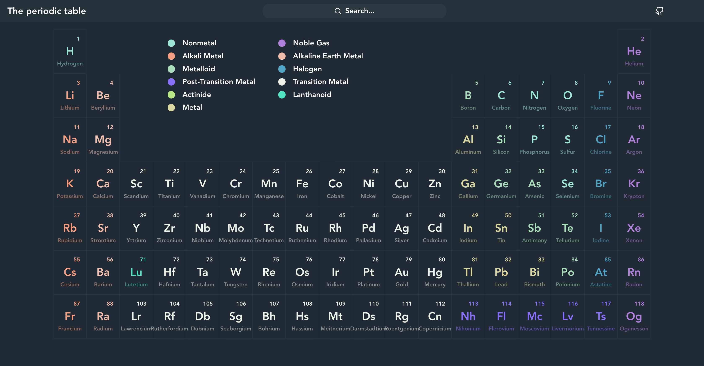
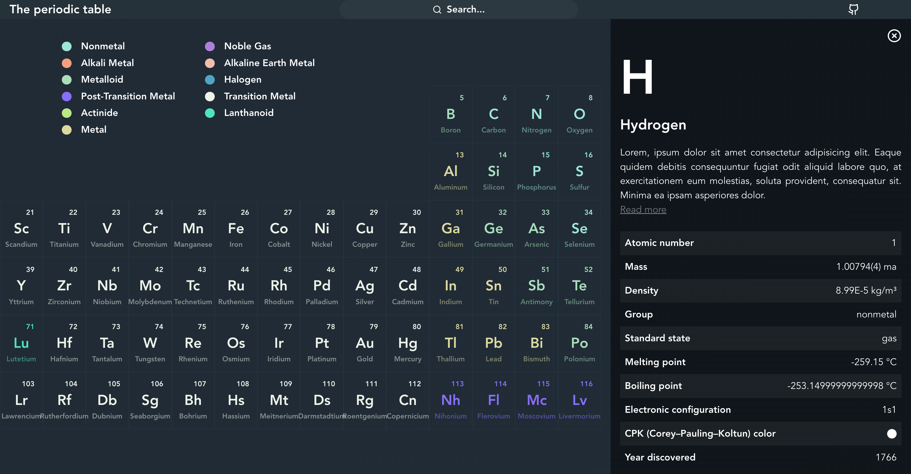

# Periodic Table

A modern and clean periodic table of elements,

## Purpose

To brush up my frontend skills 🔥 and learn CSS grid, emotion, react-query and NX.

## Demo

A live demo is available at [https://periodic-table-alpha.vercel.app/](https://periodic-table-alpha.vercel.app/).

## Screenshots

The main periodic table:

The element details:

## Used technologies

- 🎁 **Repository:** mono-repository by NX
- 🌈 **Framework:** react
- 🛠️ **Tools:** react-query
- 🎨 **Styling:** styled-components by emotion, lucide icons
- 💎 **Others:** desktop-first approach, external data source

## How to run

1. Install [Node.js](https://nodejs.org/en/download/).
2. Clone the repository.
3. Type and run: `npm i` in the root directory.
4. Type and run: `npm run dev` in the root directory.
5. Open `http://localhost:4200` in your browser to see the app.
